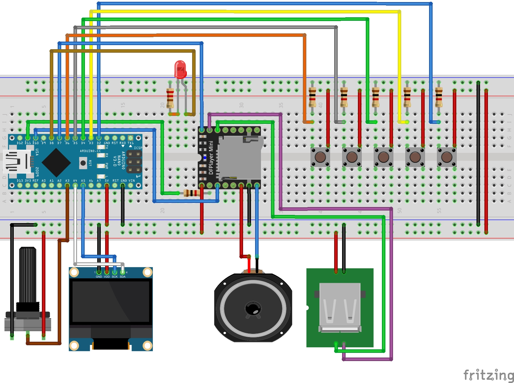

# Reproductor De Musica - ARDUINO
1. [Version con OLED y pulsadores](#reproductor-mp3-con-pulsadores)
2. [Version con LCD y control remoto](#reproductor-mp3-con-control-remoto-infrarrojo)

---
# Reproductor MP3 con pulsadores
Consiste en un reproductor de música con **PUSADORES** momentaneos para controlar usando un **Arduino Nano** o **Arduino Uno R3**, diseñado para reproducir archivos MP3 desde una tarjeta SD o una memoria USB mediante el módulo **DFPlayer Mini**. Incorpora una interfaz gráfica en una pantalla **OLED SSD1306**, botones para la navegación y control, y un sistema de configuración accesible mediante un menú interactivo.

El reproductor ofrece opciones de personalización como selección del directorio de reproducción, origen de las pistas (SD/USB), reproducción aleatoria y repetición de pistas.

## Diagrama

  

## Menu de configuracion disponible 
- **Reproducción de Pistas**  
   - Reproduce, pausa y detiene pistas.  
   - Soporta navegación entre pistas hacia adelante y atrás.  

- **Control de Volumen**  
   - Ajusta el nivel de volumen mediante un potenciómetro conectado al DFPlayer Mini.  

- **Configuración mediante Menú**  
   El menú interactivo permite personalizar el funcionamiento del reproductor:  
   - **Directorio de Reproducción**: Selecciona el directorio desde el cual se reproducirán las pistas.  
   - **Origen de Pistas**: Alterna entre SD y USB como fuente de música.  
   - **Pistas Aleatorias**: Activa o desactiva la reproducción en orden aleatorio.  
   - **Repetir Pista**: Habilita o deshabilita la repetición automática de la pista actual.  

- **Indicador de Estado**  
   - El LED integrado muestra el estado del sistema, como encendido o en reproducción activa.  

## Componentes
- **Arduino Nano** o **Uno R3**  
- **Pantalla OLED SSD1306** (interfaz I2C)  
- **Módulo DFPlayer Mini MP3 Player**  
- **Pulsadores momentáneos** (para navegación y control)  
- **Potenciómetro 10k** (control de volumen)  
- **Bocina** (máximo 4W)  
- **Diodo LED** con **resistencia de 220 ohm** (indicador de estado)  
- **Resistencias 10k** (opcional, si no se utilizan las internas del Arduino)  
- **Resistencia 10k** para el DFPlayer Mini  

## Librerías
1. **Pantalla OLED SSD1306**:  
   - [Adafruit_SSD1306](https://github.com/adafruit/Adafruit_SSD1306)  
   - [Adafruit_GFX](https://github.com/adafruit/Adafruit-GFX-Library)  

2. **Módulo DFPlayer Mini**:  
   - [DFRobotDFPlayerMini](https://github.com/DFRobot/DFRobotDFPlayerMini)  

> **Nota**: Instala estas librerías mediante el Administrador de Librerías del IDE de Arduino.

---
# Reproductor mp3 con Control Remoto Infrarrojo

Este proyecto es un reproductor de música controlado mediante un control remoto infrarrojo. Permite seleccionar pistas de audio almacenadas en una tarjeta SD, ajustar el volumen, reproducir en modo aleatorio o repetir una pista, y elegir la fuente de reproducción entre USB y SD. Toda la interacción y retroalimentación se muestra en una pantalla LCD 2x16 con módulo I2C.

## Diagrama

  

## Funciones
1. **Control mediante control remoto IR:**
   - Reproducir/Pausar
   - Selección de pistas (siguiente/anterior)
   - Ajuste de volumen
   - Activar/desactivar modo aleatorio
   - Activar/desactivar repetición de pistas
   - Selección de carpeta de pistas (1, 2 o 3)
   - Cambiar fuente de reproducción entre USB y SD
2. **Indicaciones visuales en la pantalla LCD:**
   - Número de pista actual
   - Estado de reproducción (play/pausa)
   - Fuente activa (USB/SD)
   - Nivel de volumen
   - Estados de reproducción (aleatorio/repetir)
> Insertar la tarjeta SD en el módulo DFPlayer Mini con pistas organizadas en carpetas (`01`, `02`, etc.).

### Ejemplo de Instrucciones IR
| Botón Control Remoto | Función Asignada         |
|-----------------------|--------------------------|
| **Play/Pause**        | Inicia/pausa reproducción |
| **Next**              | Pista siguiente          |
| **Previous**          | Pista anterior           |
| **Vol +**             | Incrementa volumen       |
| **Vol -**             | Reduce volumen           |
| **1, 2, 3**           | Cambiar carpeta          |
| **\***                | Activar/desactivar repetir |
| **#**                 | Activar/desactivar aleatorio |
| **0**                 | Cambiar fuente           |

> Deberás capturar por el monitor serial y reconfigurar los códigos para las funciones del reproductor cada control sus codigos son diferentes.

## Librerías
- **Pantalla LCD con I2C:** [`LiquidCrystal_I2C`](https://github.com/johnrickman/LiquidCrystal_I2C)
- **Módulo DFPlayer Mini:**[`DFRobotDFPlayerMini`](https://github.com/DFRobot/DFRobotDFPlayerMini)
- **Módulo KY-022 (Receptor IR):**[`IRRemote`](https://github.com/Arduino-IRremote/Arduino-IRremote) [Documentacion](https://github.com/Arduino-IRremote/Arduino-IRremote)

## Componentes
1. **Microcontrolador:**
   - Arduino Nano o Uno R3
2. **Componentes principales:**
   - Pantalla LCD 2x16 con módulo I2C
   - Módulo DFPlayer Mini MP3 Player
   - Módulo KY-022 (receptor IR) y control remoto
   - Resistencia de 10k para el DFPlayer
   - Potenciómetro de 10k (para control de audio)
   - Bocina (máx. 4 W)
   - Diodo LED con resistencia de 220 ohms
