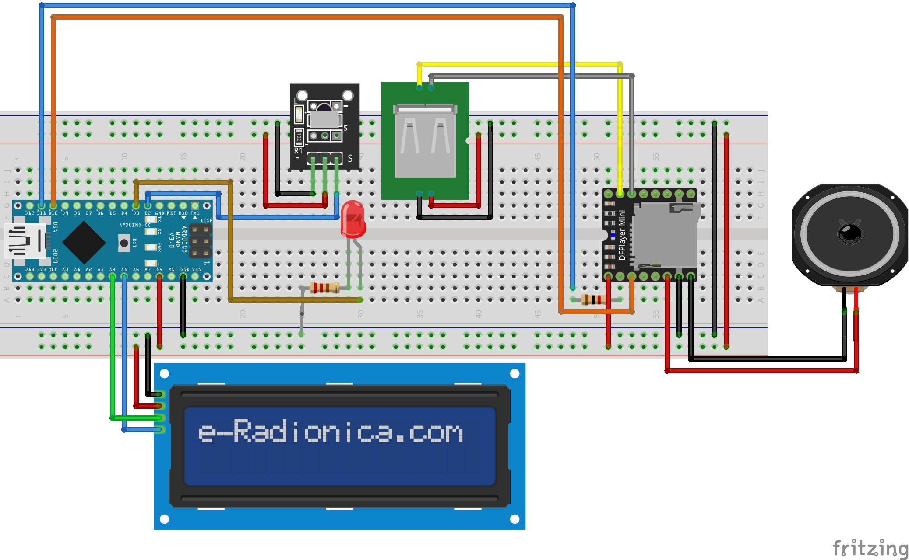

# Reproductor de Música con Control Remoto Infrarrojo

---
Este proyecto es un reproductor de música controlado mediante un control remoto infrarrojo. Permite seleccionar pistas de audio almacenadas en una tarjeta SD, ajustar el volumen, reproducir en modo aleatorio o repetir una pista, y elegir la fuente de reproducción entre USB y SD. Toda la interacción y retroalimentación se muestra en una pantalla LCD 2x16 con módulo I2C.

> Otra version [disponible](https://github.com/Herrera-Dev/Reproductor-MP3-pulsadores-Arduino) con oled y control por pulsadores.

---
## Diagrama

  

---
## Funciones
1. **Control mediante control remoto IR:**
   - Reproducir/Pausar
   - Selección de pistas (siguiente/anterior)
   - Ajuste de volumen
   - Activar/desactivar modo aleatorio
   - Activar/desactivar repetición de pistas
   - Selección de carpeta de pistas (1, 2 o 3)
   - Cambiar fuente de reproducción entre USB y SD
2. **Indicaciones visuales en la pantalla LCD:**
   - Número de pista actual
   - Estado de reproducción (play/pausa)
   - Fuente activa (USB/SD)
   - Nivel de volumen
   - Estados de reproducción (aleatorio/repetir)
> Insertar la tarjeta SD en el módulo DFPlayer Mini con pistas organizadas en carpetas (`01`, `02`, etc.).

### Ejemplo de Instrucciones IR
| Botón Control Remoto | Función Asignada         |
|-----------------------|--------------------------|
| **Play/Pause**        | Inicia/pausa reproducción |
| **Next**              | Pista siguiente          |
| **Previous**          | Pista anterior           |
| **Vol +**             | Incrementa volumen       |
| **Vol -**             | Reduce volumen           |
| **1, 2, 3**           | Cambiar carpeta          |
| **\***                | Activar/desactivar repetir |
| **#**                 | Activar/desactivar aleatorio |
| **0**                 | Cambiar fuente           |

> Deberás capturar por el monitor serial y reconfigurar los códigos para las funciones del reproductor cada control sus codigos son diferentes.

---
## Librerías
- **Pantalla LCD con I2C:** [`LiquidCrystal_I2C`](https://github.com/johnrickman/LiquidCrystal_I2C)
- **Módulo DFPlayer Mini:**[`DFRobotDFPlayerMini`](https://github.com/DFRobot/DFRobotDFPlayerMini)
- **Módulo KY-022 (Receptor IR):**[`IRRemote`](https://github.com/Arduino-IRremote/Arduino-IRremote) [Documentacion](https://github.com/Arduino-IRremote/Arduino-IRremote)

---
## Componentes
1. **Microcontrolador:**
   - Arduino Nano o Uno R3
2. **Componentes principales:**
   - Pantalla LCD 2x16 con módulo I2C
   - Módulo DFPlayer Mini MP3 Player
   - Módulo KY-022 (receptor IR) y control remoto
   - Resistencia de 10k para el DFPlayer
   - Potenciómetro de 10k (para control de audio)
   - Bocina (máx. 4 W)
   - Diodo LED con resistencia de 220 ohms

---
## Licencia
Este proyecto se distribuye bajo la **Licencia MIT**.